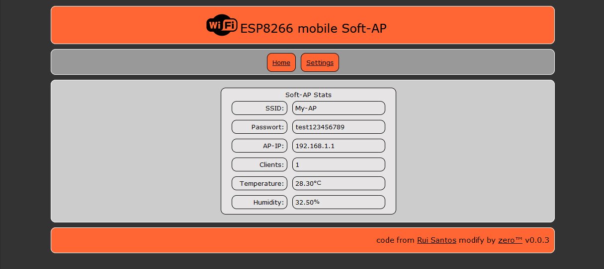
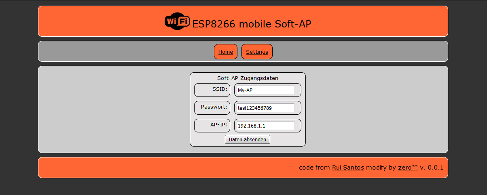
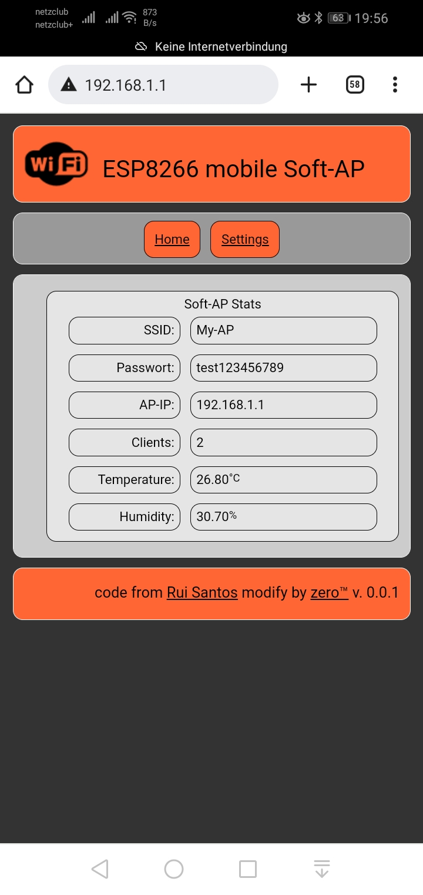
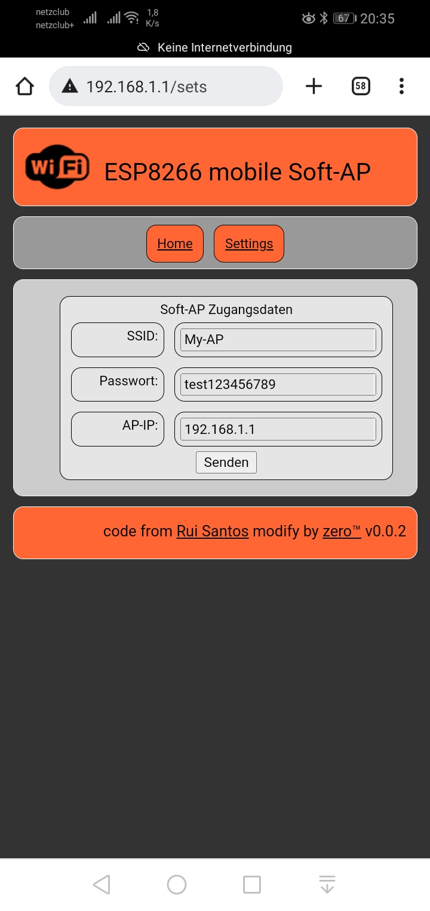

# ESP8266_Access_Point_AP
Fork from https://github.com/RuiSantosdotme/Random-Nerd-Tutorials/blob/fa34159d963cd479a13248008af3f54a1afb4066/Projects/ESP8266/ESP8266_Access_Point_AP.ino 
Website with instructions: https://randomnerdtutorials.com/esp8266-nodemcu-access-point-ap-web-server/ 
Original author's Github page: https://github.com/RuiSantosdotme 
 
changes by me
-------------
+ addet ssd1306 Display 
+ addet ws2812b Status LED  
+ addet more infos on serial console. 
+ import to platform.io 
+ config stored in eeprom 
+ addet webpanel with config & infos 
 
Last Relase: v0.0.1 

Browser (win/Firefox) 
<table>
<tr><td align="center">Home </td></tr>
<tr><td align="center">Settings </td></tr>
</table>
 
Mobile (android/chrome) 
<table><tr><td align="center">Home </td><td align="center">Settings </td></tr></table>

