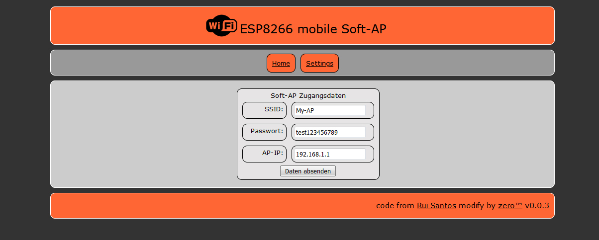

# ESP8266 mobile Access Point
###### Fork of ESP8266_Access_Point_AP.ino[^1] from Rui Santos[^3] Website with instructions: ESP8266 NodeMCU Access Point (AP) for Web Server[^2]

will no longer be developed further!
Use <a href="https://github.com/martin-ger/esp32_nat_router">https://github.com/martin-ger/esp32_nat_router</a> or
<a href="https://github.com/martin-ger/esp_wifi_repeater">https://github.com/martin-ger/esp_wifi_repeater</a> ! - His firmware is a better choice!

changes by me
-------------
+ addet ssd1306 Display 
+ addet ws2812b Status LED  
+ addet more infos on serial console. 
+ import to platform.io 
+ config stored in eeprom 
+ addet webpanel with config & infos 
+ from max 4 clients to max 8 clients switched

Last Relase: v0.0.3 
https://github.com/w4b-zero/ESP8266_Access_Point_AP/releases/tag/v0.0.3

Circuit 
<table>
<tr><td align="center"></td></tr>
</table>
 
Browser (win/Firefox) 
<table>
<tr><td align="center">Home </td></tr>
<tr><td align="center">Settings </td></tr>
</table>
 
Mobile (android/chrome) 
<table><tr><td align="center">Home </td><td align="center">Settings </td></tr></table>

[^1]: https://github.com/RuiSantosdotme/Random-Nerd-Tutorials/blob/fa34159d963cd479a13248008af3f54a1afb4066/Projects/ESP8266/ESP8266_Access_Point_AP.ino
[^2]: https://randomnerdtutorials.com/esp8266-nodemcu-access-point-ap-web-server/
[^3]: https://github.com/RuiSantosdotme
